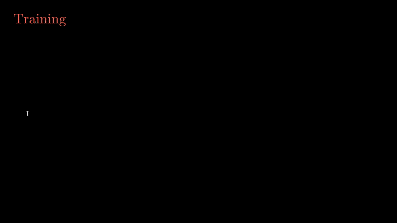

# adai
An AI for pre-diagnosing Alzheimer's Disease.



## Prerequisites
It is recommend to run the notebooks with a python3 [conda environment](https://docs.conda.io/projects/conda/en/latest/index.html) (i.e. anaconda, miniconda, etc.)

Follow the instructions on the [pytorch website](https://pytorch.org/get-started/locally/#start-locally) to install pytorch. Then, after activating the conda env run:
```bash
pip install -r requirements.txt
```

## Getting Data
You can request access to the data [here](https://www.oasis-brains.org/). Make sure you request the OASIS 3 brains dataset. Download the data in the [plain folder format](https://github.com/NrgXnat/oasis-scripts#download_scansdownload_oasis_scanssh). Once you get the Pib PET/MRI data, put it anywhere you like (ideally in the same folder as this repo) and change the `DATA_DIR` variable in the notebook you wish to use. Also, make sure to get the diagnosis of the patients by clicking on the "spreadsheet" value on data explorer.

## Notebooks
| Notebook Name                                                                                | Description                                                                                                                                                           |
| -------------------------------------------------------------------------------------------- | --------------------------------------------------------------------------------------------------------------------------------------------------------------------- |
| [`mri_3d_resnet_pretrained.ipynb`](./mri_3d_resnet_pretrained.ipynb)                         | 3D residual neural network trained on MRI data, pretrained on [MedicalNet](https://github.com/Tencent/MedicalNet)                                                     |
| [`pet_3d_resnet_with_linear_pretrained.ipynb`](./pet_3d_resnet_with_linear_pretrained.ipynb) | 3D residual neural network trained on PET data, pretrained on [MedicalNet](https://github.com/Tencent/MedicalNet), uses linear layers for the collection of 3D frames |
| [`pet_3d_resnet_with_linear.ipynb`](./pet_3d_resnet_with_linear.ipynb)                       | 3D residual neural network trained on PET data, uses linear layers for the collection of 3D frames                                                                    |
| [`pet_3d_resnet_with_lstm.ipynb`](./pet_3d_resnet_with_lstm.ipynb)                           | 3D residual neural network trained on PET data, uses lstm layers for the collection of 3D frames                                                                      |


